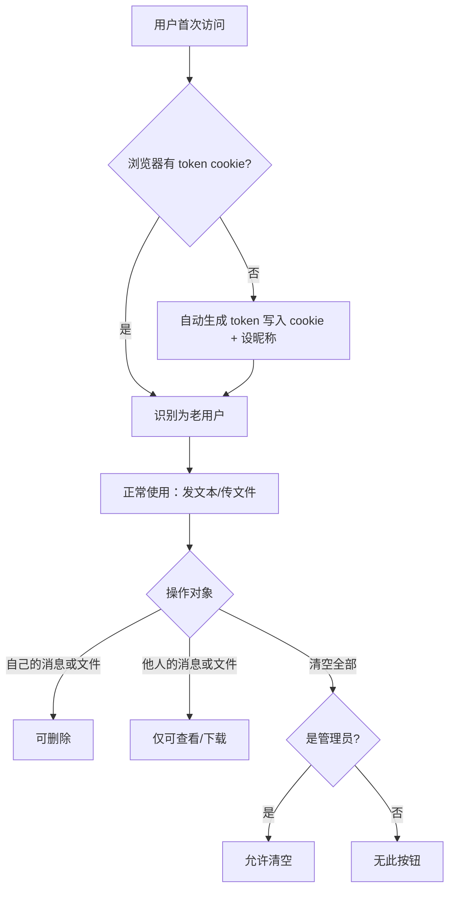

# LocalDrop 多人共用部署改造

## 问题框架

LocalDrop 当前是个人桌面工具，数据存内存、无用户区分、任何人可删除任何内容。现需部署到部门内网服务器供 10-50 人共用，核心挑战是：在保持"随用随走"的轻量体验的同时，解决数据安全和多人共存问题。

## 需求

### P0 — 多人共用的硬性前提

**数据持久化**
- R1. 运行时数据保持在内存中（与当前一致），变更时异步写入 JSON 文件，启动时从文件加载。Node.js 单线程保证内存操作无并发冲突，JSON 文件仅作持久化快照
- R2. 上传的文件继续使用文件系统存储，元信息与物理文件路径对应

**用户身份（免登录）**
- R3. 首次访问时自动生成唯一 token，通过 HTTP-only cookie 存储并随请求自动发送，作为用户标识。服务端使用 `cookie-parser` 中间件读取
- R4. 首次访问时引导用户设置昵称，昵称与 token 一起存储在服务端。同设备再次访问时服务端根据 token 返回昵称，前端自动填入作者字段；跨设备需重新设置一次昵称
- R5. 用户只能删除自己发布的消息和文件，不能删除他人的。用户丢失 token（清 cookie、换浏览器）后，其历史消息和文件成为孤儿内容，仅管理员可删除——这是免登录方案的已知取舍

**管理员功能**
- R6. 管理员密钥通过环境变量 `ADMIN_KEY` 配置，管理员在页面输入密钥激活权限（密钥换取 session token 存入 cookie）
- R7. 管理员可清空所有消息和文件、删除任意内容、查看存储使用统计
- R8. 普通用户界面不显示"清空全部"按钮

**运维适配**
- R18. 移除 exe 打包相关的交互逻辑（`waitForUserInput`、`process.pkg` 分支），改为纯服务端运行模式。`build.js` 保留但不作为本次改造范围
- R19. 使用 `morgan` 中间件输出结构化访问日志（含时间戳和来源 IP）

### P1 — 体验提升（功能可用但无此项亦可上线）

**上传进度显示**
- R14. 大文件上传时前端显示上传进度条和百分比。当前 `fetch()` 不支持上传进度，需改用 `XMLHttpRequest` 的 `upload.onprogress`
- R15. 上传过程中可取消上传（`xhr.abort()`）

**消息实时推送**
- R16. 新消息或新文件上传后，其他在线用户自动收到更新，无需手动刷新（替代当前 5 秒轮询）
- R17. 使用 SSE 实现。客户端利用 `EventSource` 自动重连；服务端为每次重连发送当前完整列表或使用 `Last-Event-ID` 增量推送

### P2 — 运营便利（可后续迭代）

**存储管理**
- R9. 自动过期清理：消息和文件超过可配置天数（默认 7 天）后，在下次清理时删除。清理在启动时运行一次即可满足大部分场景；如需定时清理，使用 `setInterval`
- R10. 总存储上限可配置，上传前检查当前总量（通过内存中的文件元信息累加），超限则拒绝并提示原因。单文件大小上限沿用 multer 现有配置
- R11. 清理过程跳过正在被下载的文件（通过活跃下载计数器判断），避免中断传输

**配置管理**
- R12. 端口、存储路径、过期天数、文件大小限制、总存储上限、管理员密钥等均通过环境变量配置，带合理默认值。支持 `.env` 文件（通过 `dotenv`），不构建自定义配置系统

## 成功标准

- 服务重启后，之前的消息和文件仍然可用
- 用户 A 无法删除用户 B 的消息或文件
- 管理员可以管理所有消息和文件，普通用户看不到管理功能
- 超过过期天数的消息和文件自动被清理
- 存储超限时新上传被拒绝并提示原因
- 多个用户同时使用时，新消息和文件实时推送到其他客户端

## 范围边界

- **不做**正式的账号注册/登录系统——保持免登录体验
- **不做**文件分享权限控制（如私密文件）——所有上传的文件所有人可见可下载
- **不做**消息搜索功能——当前规模不需要
- **不做** HTTPS——内网环境，由运维层面处理
- **不做**多实例部署/集群——单机足够
- **不做**反向代理兼容性适配——如部署在 nginx 后需运维自行配置 SSE 透传

## 关键决策

- **免登录 + cookie token**：token 通过 HTTP-only cookie 自动随请求发送，无需前端手动附加 header。用户换浏览器或清 cookie 会被视为新用户，历史内容成为孤儿（仅管理员可删）
- **内存优先 + JSON 快照**：运行时操作内存数组（与当前架构一致），变更时异步写入 JSON 文件。Node.js 单线程消除并发写入问题，无需文件锁
- **SSE 替代轮询**：替换当前 5 秒 `setInterval` 轮询，利用 `EventSource` 原生自动重连
- **环境变量而非配置文件**：`dotenv` + 环境变量，零抽象成本，部署友好
- **管理员密钥而非管理员账号**：环境变量配置，页面输入激活，适合内部工具场景

## 依赖 / 假设

- 部署服务器有 Node.js >= 18 运行环境
- 内网环境，信任网络内用户不会恶意伪造 cookie token
- 服务器磁盘空间充足但有限，自动清理作为兜底
- 新增依赖：`cookie-parser`（解析 cookie）、`dotenv`（环境变量）、`morgan`（日志）

## 待解决问题

### 延迟到规划阶段
- [影响 R17][技术] SSE 在反向代理后的超时配置建议（文档层面）
- [影响 R18][需调研] `build.js` 是否需要适配新架构（如移除 `process.pkg` 引用），还是保持原样不动

## 下一步

→ `/mc:plan` 进行结构化实施规划
