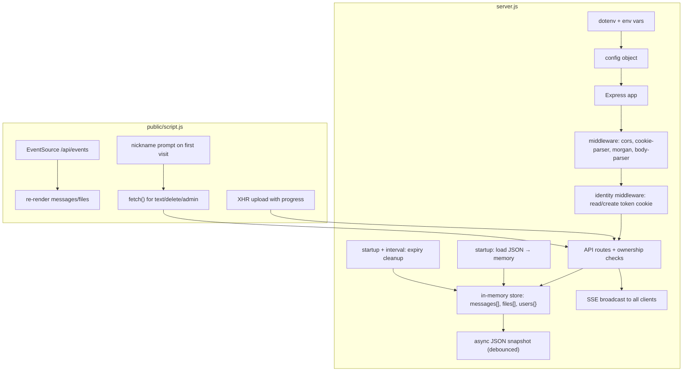
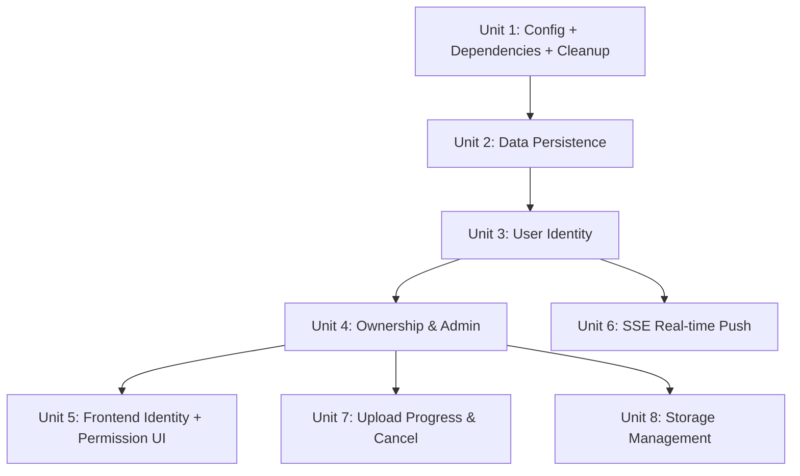

# feat: Multi-user deployment upgrade for LocalDrop

## Overview

将 LocalDrop 从个人桌面工具改造为部门内网共用服务（10-50 人）。核心变更：添加数据持久化、免登录用户身份、权限控制、实时推送、上传进度、存储管理，同时保持"随用随走"的轻量体验。

## Problem Frame

当前 LocalDrop 数据存内存（重启即丢）、无用户区分（任何人可删除任何内容）、前端靠 5 秒轮询刷新。这些在个人使用时无问题，但多人共用时会导致数据丢失和误删。(see origin: docs/brainstorms/2026-04-07-multi-user-deployment-requirements.md)

## Requirements Trace

**P0 — 多人共用硬性前提：**
- R1. 内存优先 + JSON 快照持久化
- R2. 文件系统存储，元信息与物理文件对应
- R3. HTTP-only cookie token 自动身份识别
- R4. 昵称存服务端，同设备自动恢复
- R5. 用户仅能删除自己的消息和文件
- R6. 管理员密钥通过 `ADMIN_KEY` 环境变量配置
- R7. 管理员可清空全部、删除任意内容、查看统计
- R8. 普通用户不显示"清空全部"按钮
- R18. 移除 `process.pkg` 分支，纯服务端模式
- R19. `morgan` 结构化日志

**P1 — 体验提升：**
- R14. 上传进度条（XHR `upload.onprogress`）
- R15. 上传可取消（`xhr.abort()`）
- R16. SSE 实时推送替代轮询
- R17. `EventSource` 自动重连

**P2 — 运营便利：**
- R9. 自动过期清理（默认 7 天）
- R10. 总存储上限，上传前检查
- R11. 清理跳过活跃下载
- R12. 环境变量 + `dotenv` 配置

## Scope Boundaries

- 不做登录/注册系统
- 不做文件权限控制（所有文件对所有人可见）
- 不做消息搜索
- 不做 HTTPS（运维层面处理）
- 不做多实例/集群
- 不做反向代理适配
- `build.js` 保留原样，不做适配

## Context & Research

### Relevant Code and Patterns

- `server.js` (431 行) — 扁平 Express 应用，6 个 REST 端点，全局 `textMessages[]` 和 `uploadedFiles[]` 数组，`messageId` / `fileId` 自增计数器
- `public/script.js` (~1000 行) — vanilla JS，`setInterval` 5 秒轮询，`loadMessagesSilently()` / `loadFilesSilently()` 静默刷新，`isUserInteracting()` 交互检测
- 前端所有 API 调用使用 `fetch()`，无共享 HTTP 客户端
- `multer` 配置：磁盘存储，5GB 限制，文件名 `timestamp_random_originalname`
- `process.pkg` 分支出现在：静态文件路径 (L56-65)、uploads 目录 (L77-83)、启动信息 (L325-351)、启动流程 (L398-428)
- 消息提交后用 `addNewMessageToTop()` 乐观插入，1 秒后 `loadMessagesSilently()` 同步
- 清空按钮 `clearBtn` (L289-309) 无任何权限检查

### Institutional Learnings

无 `docs/solutions/` 目录，无历史团队经验。

## Key Technical Decisions

- **内存优先 + JSON 快照**：保持当前内存数组架构不变，变更时用 `fs.writeFile` 异步写入 JSON。Node.js 单线程保证内存操作无竞态。启动时 `fs.readFileSync` 加载。(see origin)
- **HTTP-only cookie**：token 随请求自动发送，无需前端手动附加 header。服务端用 `cookie-parser` 读取。(see origin)
- **SSE 而非 WebSocket**：单向推送即可，无额外依赖。客户端 `EventSource` 内建自动重连。(see origin)
- **环境变量 + dotenv**：零抽象成本，部署友好。(see origin)
- **XHR 替代 fetch 进行文件上传**：`fetch()` 不支持上传进度事件，必须改用 `XMLHttpRequest`。仅影响文件上传逻辑，消息提交保持 `fetch()`。
- **用户双 ID 设计**：每个用户有 `token`（机密，HTTP-only cookie，仅用于服务端认证）和 `publicId`（非机密，可暴露给前端）。消息/文件记录存储 `ownerToken`（服务端权限校验用）和 `ownerPublicId`（前端所有权展示用）。SSE 广播仅包含 `ownerPublicId`，绝不暴露 `ownerToken`。服务端维护 `users` Map（token → {publicId, nickname, createdAt}）。
- **输入校验与 XSS 防护**：多人使用后用户 A 的输入会展示给用户 B，必须防范 XSS。昵称限制 20 字符且过滤 HTML 标签；消息内容无长度限制但前端渲染必须使用 `textContent` 而非 `innerHTML`；文件名在 `Content-Disposition` 中正确转义。

## Open Questions

### Resolved During Planning

- **JSON 写入安全性**：不需要文件锁。运行时操作内存数组，JSON 文件仅是异步快照。防抖（debounce）保证同一时间只有一个 `writeFile` 在执行。写入使用 write-to-temp-then-rename 模式（先写 `.tmp` 文件再 `fs.rename`），确保原子性——即使写入过程中崩溃也不会产生损坏的 JSON 文件。每个数据文件维护独立的防抖 timer，避免不同文件的写入互相取消。
- **SSE 断线重连**：`EventSource` 自动重连是浏览器内建行为。服务端在每次连接建立时发送当前完整数据快照，无需 `Last-Event-ID` 增量追踪——数据量小（10-50 人规模），全量推送成本可忽略。
- **管理员 session 存储**：管理员输入密钥后，服务端生成随机 admin session token 存入 cookie。服务端维护一个 `adminSessions` Set 验证。
- **`build.js` 处理**：保留原样不动，不在本次范围内。

### Deferred to Implementation

- 防抖写入的具体延迟值（建议 500ms-1s，实施时根据体感调整）
- SSE 推送的数据格式细节（事件分类粒度）
- 前端管理员 UI 的具体布局位置

## High-Level Technical Design

> *这说明了预期方法，是供审查的方向性指引，而非实现规范。实施 agent 应将其视为上下文，而非需要复现的代码。*



## Implementation Units

实施单元按依赖关系排序。P0 单元（1-5）必须全部完成才能上线；P1（6-7）和 P2（8）可独立迭代，彼此无依赖。



---

- [ ] **Unit 1: Config, Dependencies & Server Cleanup**

**Goal:** 建立配置基础，清理 exe 打包残留，添加基础中间件。

**Requirements:** R12, R18, R19

**Dependencies:** None

**Files:**
- Create: `.env.example`
- Modify: `server.js`
- Modify: `package.json`

**Approach:**
- 安装 `dotenv`、`cookie-parser`、`morgan` 三个新依赖
- 在 `server.js` 顶部加载 `dotenv/config`，创建 config 对象从 `process.env` 读取所有可配置项（PORT、UPLOADS_DIR、ADMIN_KEY、MAX_FILE_SIZE、MAX_TOTAL_STORAGE、EXPIRE_DAYS），每项带默认值
- 移除所有 `process.pkg` 条件分支（约 5 处）：静态文件路径、uploads 目录选择、启动信息、`waitForUserInput`、setTimeout 延迟启动。统一为单一路径
- 添加 `morgan('combined')` 中间件
- 添加 `cookieParser()` 中间件
- 用 config 对象替换硬编码的 `PORT`、`uploadsDir`、multer `fileSize` 限制
- 创建 `.env.example` 列出所有可配置环境变量及默认值

**Patterns to follow:**
- 保持 `server.js` 扁平结构，不引入路由分离（保持与现有架构一致）

**Test scenarios:**
- Happy path: 不提供 `.env` 文件时，服务使用默认配置正常启动（端口 9999，uploads 在项目目录下）
- Happy path: 提供 `PORT=8080` 环境变量时，服务监听 8080
- Edge case: `ADMIN_KEY` 未设置时，管理员功能不可用（后续单元处理具体逻辑）
- Error path: `UPLOADS_DIR` 指向不存在的路径时，自动创建目录

**Verification:**
- 服务无 `process.pkg` 引用即可在 `node server.js` 下正常启动
- `morgan` 输出请求日志到 stdout
- 所有硬编码值已被 config 对象替代

---

- [ ] **Unit 2: Data Persistence Layer**

**Goal:** 实现内存数据的 JSON 文件持久化，服务重启后数据不丢失。

**Requirements:** R1, R2

**Dependencies:** Unit 1 (config for storage paths)

**Files:**
- Modify: `server.js`

**Approach:**
- 定义数据文件路径：`{UPLOADS_DIR}/../data/messages.json`、`{UPLOADS_DIR}/../data/files.json`、`{UPLOADS_DIR}/../data/users.json`（均从 config 派生）
- 启动时：尝试 `fs.readFileSync` 加载三个 JSON 文件到内存数组/对象，文件不存在则用空数组/对象初始化，同时恢复 `messageId` / `fileId` 计数器为已有数据的最大 id + 1
- 实现 `saveMessages()`、`saveFiles()`、`saveUsers()` 三个异步保存函数，**每个函数维护独立的防抖 timer**（500ms），避免不同文件的写入互相取消
- 实际写入使用 **write-to-temp-then-rename** 模式：先 `fs.writeFile` 到 `{path}.tmp`，再 `fs.rename` 覆盖原文件，保证原子性
- 在每个变更数据的路由处理器末尾调用对应的 save 函数（post message → `saveMessages()`，delete message → `saveMessages()`，upload file → `saveFiles()`，等）
- 文件物理存储路径不变（multer 已管理），JSON 仅存元信息

**Technical design:** *(方向性指引)*
```
// 防抖保存伪代码 — 每个数据文件独立 timer
function createDebouncedSaver(filePath):
  let timer = null  // 独立 timer
  return function save(data):
    clearTimeout(timer)
    timer = setTimeout(() =>
      tmpPath = filePath + '.tmp'
      fs.writeFile(tmpPath, JSON.stringify(data, null, 2))
      fs.rename(tmpPath, filePath)  // 原子替换
    , 500)

saveMessages = createDebouncedSaver(messagesPath)
saveFiles = createDebouncedSaver(filesPath)
saveUsers = createDebouncedSaver(usersPath)
```

**Patterns to follow:**
- 沿用现有 `textMessages` / `uploadedFiles` 变量名和数据结构
- 沿用现有 uploads 目录创建逻辑（已有 `fs.mkdirSync` with `recursive: true`）

**Test scenarios:**
- Happy path: 发送消息后，`messages.json` 在 ~500ms 内写入磁盘，内容与内存一致
- Happy path: 重启服务后，GET `/api/messages` 返回之前的消息
- Happy path: 上传文件后，`files.json` 更新，物理文件存在于 uploads 目录
- Edge case: 首次启动无 JSON 文件时，正常初始化空数组
- Edge case: JSON 文件损坏（无效 JSON）时，日志警告并用空数组初始化，不崩溃
- Edge case: `messageId` / `fileId` 从已有数据的最大 id 恢复，不产生 id 冲突
- Integration: 删除消息 → 内存更新 → JSON 更新 → 重启 → 消息确实不存在

**Verification:**
- 手动重启 `node server.js` 后，之前创建的消息和文件元信息完整恢复
- uploads 目录中的物理文件与 `files.json` 中的记录一一对应

---

- [ ] **Unit 3: User Identity (Server-side Token + Nickname)**

**Goal:** 实现免登录用户身份识别，通过 cookie token 自动关联用户，昵称存服务端。

**Requirements:** R3, R4

**Dependencies:** Unit 2 (persistence for users data)

**Files:**
- Modify: `server.js`

**Approach:**
- 添加身份中间件（在所有 API 路由之前）：检查 `req.cookies.token`，若无则生成 UUID（`crypto.randomUUID()`），设置 HTTP-only cookie（`res.cookie('token', uuid, { httpOnly: true, maxAge: 365*24*60*60*1000, sameSite: 'lax' })`）
- 维护 `users` 对象（Map<token, {publicId, nickname, createdAt}>），中间件中将 `req.userToken`、`req.publicId` 和 `req.nickname` 挂载到 request 上。`publicId` 使用独立的 `crypto.randomUUID()` 生成，与 token 不同
- 新增 `GET /api/user` 端点：返回当前用户的 `publicId` 和 `nickname`（前端缓存 `publicId` 用于所有权判断，`nickname` 用于自动填入作者字段）。**绝不返回 token 本身**
- 新增 `POST /api/user/nickname` 端点：设置/更新昵称，保存到 `users` 对象并持久化
- 修改 `POST /api/messages`：记录 `ownerToken`（服务端权限用）和 `ownerPublicId`（前端展示用）。**显示名始终使用服务端 `req.nickname`**，忽略客户端请求体中的 author 字段。若用户未设置昵称，默认显示"匿名用户"
- 修改 `POST /api/files`：同上，文件记录添加 `ownerToken` + `ownerPublicId`，uploader 字段使用 `req.nickname`
- **数据迁移**：从 JSON 加载的已有消息/文件若无 `ownerToken` 字段，视为孤儿内容（`ownerToken: null`、`ownerPublicId: null`），仅管理员可删除
- **输入校验**：`POST /api/user/nickname` 校验昵称长度（≤20 字符）并剥离 HTML 标签
- 所有变更触发 `saveUsers()`

**Patterns to follow:**
- 使用 Node.js 内置 `crypto.randomUUID()`（Node 18+），无需额外依赖
- cookie 配置：`httpOnly: true`（防 XSS 读取）、`sameSite: 'lax'`（允许同站导航）、长过期时间

**Test scenarios:**
- Happy path: 首次请求 → 响应 Set-Cookie 包含新 token → 后续请求自动携带
- Happy path: `GET /api/user` 返回 token 对应的昵称
- Happy path: `POST /api/user/nickname` 设置昵称后，消息的 author 字段自动使用
- Edge case: token cookie 存在但服务端无对应记录（重启后 users.json 存在） → 视为新用户，自动创建
- Edge case: 不同浏览器/设备 → 不同 token，各自独立昵称
- Integration: 设置昵称 → 重启服务 → `GET /api/user` 仍返回正确昵称

**Verification:**
- 浏览器 DevTools 可见 `token` cookie（HttpOnly）
- 消息和文件记录包含 `ownerToken` 字段

---

- [ ] **Unit 4: Ownership Checks & Admin Backend**

**Goal:** 实现删除权限控制和管理员后端功能。

**Requirements:** R5, R6, R7, R8

**Dependencies:** Unit 3 (user identity)

**Files:**
- Modify: `server.js`

**Approach:**
- **删除权限**：修改 `DELETE /api/messages/:id` 和 `DELETE /api/files/:id`，比较 `req.userToken` 与记录的 `ownerToken`，不匹配则 403
- **管理员认证**：新增 `POST /api/admin/login` 端点，接收密钥与 `config.ADMIN_KEY` 比较（常量时间比较 `crypto.timingSafeEqual`），匹配则生成 admin session token 写入 cookie（`maxAge` 与 session TTL 一致），存入 `adminSessions` Map（token → {createdAt}）
- **登录速率限制**：维护 `loginAttempts` Map（IP → {count, lastAttempt}），每 IP 每分钟最多 5 次尝试，超出返回 429。每次成功登录重置计数
- **管理员登出**：新增 `POST /api/admin/logout`，从 `adminSessions` 移除 token，清除 admin cookie
- **session 过期**：admin session TTL 默认 4 小时（可通过 `ADMIN_SESSION_TTL` 环境变量配置）。管理员中间件检查时验证 `createdAt + TTL > now`，过期则移除并视为未认证
- **管理员中间件**：检查 `req.cookies.adminToken` 是否在 `adminSessions` 中，将 `req.isAdmin` 挂载到 request
- **管理员绕过**：删除路由中 `req.isAdmin === true` 则跳过 ownerToken 检查
- **清空路由**：修改 `DELETE /api/messages`（清空全部）和 `DELETE /api/files`（清空全部），要求 `req.isAdmin === true`，否则 403
- **统计端点**：新增 `GET /api/admin/stats`，返回消息总数、文件总数、总存储占用、用户数
- **状态端点**：新增 `GET /api/admin/status`，检查 `req.cookies.adminToken` 是否在 `adminSessions` 中，返回 `{ isAdmin: boolean }`。前端页面加载时调用此端点决定是否显示管理员 UI
- **ADMIN_KEY 未配置时**：管理员登录端点返回 404，`GET /api/admin/status` 始终返回 `{ isAdmin: false }`
- GET `/api/messages` 和 `GET /api/files` 响应中为每条记录附加 `isOwner` 布尔字段（比较 `req.userToken`）。**响应中包含 `ownerPublicId` 但绝不包含 `ownerToken`**。同时从响应中移除 `ip` 字段（IP 信息仅保留在服务端日志中）
- **输入校验**：消息内容不允许空字符串（沿用现有校验），昵称/消息/文件名在存储时剥离 HTML 标签或在 JSON 序列化时确保安全

**Patterns to follow:**
- 使用 `crypto.timingSafeEqual` 做密钥比较，防时序攻击
- admin session 不持久化（重启后管理员需重新输入密钥——可接受）
- 速率限制使用内存 Map，定期清理过期记录

**Test scenarios:**
- Happy path: 用户删除自己的消息 → 200 成功
- Happy path: 管理员输入正确密钥 → 获得 admin cookie → 可删除任意内容、清空全部
- Error path: 用户删除他人消息 → 403 forbidden
- Error path: 普通用户调用 `DELETE /api/messages`（清空）→ 403
- Error path: 管理员密钥错误 → 401
- Edge case: `ADMIN_KEY` 未设置 → `POST /api/admin/login` 返回 404
- Edge case: 管理员 session 在服务重启后失效 → 需重新输入密钥
- Edge case: 管理员 session 超过 4 小时 → 自动失效，需重新登录
- Error path: 同一 IP 连续 6 次错误密钥 → 第 6 次返回 429
- Happy path: `POST /api/admin/logout` → admin cookie 清除，后续请求无管理权限
- Integration: `GET /api/messages` 响应包含 `isOwner` 和 `ownerPublicId`，不包含 `ownerToken` 和 `ip`

**Verification:**
- 非 owner 用户删除操作被拒绝
- 管理员可执行所有管理操作
- API 响应包含 `isOwner` 字段

---

- [ ] **Unit 5: Frontend Identity & Permission UI**

**Goal:** 前端适配用户身份、昵称管理和权限 UI。

**Requirements:** R4, R5, R8

**Dependencies:** Unit 4 (backend identity + admin)

**Files:**
- Modify: `public/script.js`
- Modify: `public/index.html`
- Modify: `public/style.css`

**Approach:**
- **昵称引导**：页面加载时调用 `GET /api/user`，若无昵称则弹出输入框引导设置（调用 `POST /api/user/nickname`），设置后自动填入作者字段
- **自动填充**：移除 HTML 中的 author/uploader 手动输入框，改为从服务端获取的昵称自动填入（或在页面顶部显示当前身份）
- **删除按钮**：`displayMessages()` 和 `displayFiles()` 中，根据 `isOwner` 字段决定是否渲染删除按钮
- **删除按钮**：前端在页面加载时从 `GET /api/user` 获取并缓存自身 `publicId`。无论数据来自 REST（含 `isOwner`）还是 SSE（含 `ownerPublicId`），统一使用 `ownerPublicId === myPublicId` 判断所有权，决定是否渲染删除按钮。REST 的 `isOwner` 作为冗余便利字段保留但不作为唯一依据
- **清空按钮**：`clearBtn` 默认隐藏。页面加载时检查管理员状态（`GET /api/admin/status`），管理员才显示
- **管理员入口**：添加页面底部或设置区域的"管理员登录"入口，输入密钥后调用 `POST /api/admin/login`
- **管理员 UI**：登录后显示清空按钮、统计信息入口
- **错误处理**：删除操作返回 403 时显示"无权限删除"提示

**Patterns to follow:**
- 沿用现有 `showNotification()` 函数做提示
- 沿用现有 tab 切换模式做管理员 UI

**Test scenarios:**
- Happy path: 首次访问 → 昵称引导弹出 → 设置后自动填入
- Happy path: 再次访问 → 无引导弹出，昵称自动填入
- Happy path: 自己的消息显示删除按钮，他人的不显示
- Happy path: 管理员登录后看到清空按钮和统计
- Error path: 删除他人消息（通过 DevTools 调用 API）→ 403 → 前端提示无权限
- Edge case: 清除 cookie 后再访问 → 视为新用户，重新引导昵称

**Verification:**
- 普通用户看不到"清空全部"按钮
- 只有自己的内容旁有删除按钮
- 昵称设置一次后自动恢复

---

- [ ] **Unit 6: SSE Real-time Push**

**Goal:** 用 SSE 替代 5 秒轮询，实现消息和文件的实时推送。

**Requirements:** R16, R17

**Dependencies:** Unit 3 (identity middleware for SSE connections)

**Files:**
- Modify: `server.js`
- Modify: `public/script.js`

**Approach:**
- **服务端 SSE 端点**：新增 `GET /api/events`，设置响应头 `Content-Type: text/event-stream`、`Cache-Control: no-cache`、`Connection: keep-alive`。维护 `clients` 数组存储所有活跃 `res` 对象
- **广播函数**：`broadcast(eventType)` 遍历 `clients`，向所有连接推送相同数据（单次 `JSON.stringify`）。数据包含 `ownerPublicId`（非机密）但**绝不包含 `ownerToken`**（机密认证凭证）。前端通过 `GET /api/user` 已知自己的 `publicId`，本地比较 `ownerPublicId === myPublicId` 计算所有权
- **触发广播**：在消息/文件的增删改路由末尾调用 broadcast，事件类型如 `messages-updated`、`files-updated`
- **连接建立时推送全量**：新 SSE 连接建立时，立即推送当前完整的消息列表和文件列表
- **连接清理**：监听 `req.on('close')` 从 `clients` 数组移除断开的连接
- **前端替换轮询**：移除 `setInterval` 轮询逻辑和 `addNewMessageToTop()` 乐观插入逻辑，改用 `EventSource('/api/events')`。用户提交消息后不再本地乐观插入——SSE 会在极短延迟（< 100ms）后推送更新，体验接近即时
- **前端所有权判断**：页面加载时从 `GET /api/user` 获取自身 `publicId` 并缓存。收到 SSE 数据后，前端遍历列表比较 `ownerPublicId === myPublicId` 来决定删除按钮显示
- **`EventSource` 自动重连**：浏览器内建，断线后自动重连并收到全量数据
- **保留手动刷新**：刷新按钮仍然可用，但改为关闭当前 SSE 连接并重新建立

**Technical design:** *(方向性指引)*
```
// SSE 推送伪代码
GET /api/events:
  res.writeHead(200, SSE headers)
  clients.push(res)
  // 立即推送当前数据（含 ownerPublicId，不含 ownerToken）
  sanitized = stripPrivateFields(messages)  // 移除 ownerToken, ip
  res.write(event: init, data: { messages: sanitized, files: ... })
  req.on('close') → remove from clients

broadcast(type):
  sanitized = stripPrivateFields(data)  // 单次序列化，所有客户端相同
  payload = JSON.stringify(sanitized)
  for each client in clients:
    client.write(event: type, data: payload)

// 前端所有权判断
onSSEMessage(data):
  myPublicId = cachedPublicId  // 从 GET /api/user 获取并缓存
  data.forEach(item => item.isOwner = item.ownerPublicId === myPublicId)
  render(data)
```

**Patterns to follow:**
- SSE 标准格式：`event: name\ndata: json\n\n`
- 沿用现有 `displayMessages()` / `displayFiles()` 渲染函数

**Test scenarios:**
- Happy path: 用户 A 发消息 → 用户 B 的页面自动更新显示新消息
- Happy path: 用户 A 上传文件 → 用户 B 的页面自动显示新文件
- Happy path: 删除消息 → 所有在线用户页面自动移除该消息
- Edge case: SSE 连接断开 → 浏览器自动重连 → 重连后收到完整数据
- Edge case: 50 个并发 SSE 连接 → 服务端正常广播无阻塞
- Edge case: 用户关闭页面 → 服务端正确清理 clients 数组
- Integration: 消息提交 → 内存更新 → JSON 持久化 → SSE 广播 → 其他客户端渲染，整个链路 < 1 秒

**Verification:**
- 两个浏览器窗口打开，一方发消息另一方即时看到
- 无 `setInterval` 轮询代码残留
- 前端无周期性 API 请求（DevTools Network 面板确认）

---

- [ ] **Unit 7: Upload Progress & Cancel**

**Goal:** 大文件上传时显示进度条，支持取消上传。

**Requirements:** R14, R15

**Dependencies:** Unit 4 (backend with identity, so uploader field uses nickname)

**Files:**
- Modify: `public/script.js`
- Modify: `public/index.html`
- Modify: `public/style.css`

**Approach:**
- **XHR 替换 fetch**：仅文件上传逻辑从 `fetch()` 改为 `XMLHttpRequest`，消息提交保持 `fetch()`
- **进度条 UI**：在文件上传区域下方添加进度条 HTML（默认隐藏），包含进度条元素、百分比文本、取消按钮
- **进度回调**：`xhr.upload.onprogress = (e) => { percent = e.loaded / e.total * 100 }` 更新进度条宽度和文本
- **取消上传**：取消按钮调用 `xhr.abort()`，恢复上传区域到初始状态
- **完成/失败处理**：`xhr.onload` 处理成功响应，`xhr.onerror` / `xhr.onabort` 处理失败和取消
- **样式**：进度条使用 CSS 过渡动画，与现有 UI 风格一致

**Patterns to follow:**
- 沿用现有 `showNotification()` 做上传成功/失败/取消提示
- 沿用现有 `formatFileSize()` 显示已上传/总大小

**Test scenarios:**
- Happy path: 上传 100MB+ 文件 → 进度条从 0% 渐进到 100% → 成功提示
- Happy path: 上传过程中点击取消 → 上传中止 → UI 恢复初始状态
- Edge case: 小文件（< 1MB）上传 → 进度条快速闪过或直接跳到 100%，不影响体验
- Error path: 网络中断 → 上传失败 → 错误提示，进度条消失
- Error path: 文件超过大小限制 → multer 拒绝 → 前端显示错误

**Verification:**
- 上传大文件时进度条可见且递增
- 取消按钮能中止上传
- 小文件上传体验不退化

---

- [ ] **Unit 8: Storage Management**

**Goal:** 实现自动过期清理和存储配额检查。

**Requirements:** R9, R10, R11

**Dependencies:** Unit 4 (ownership, admin for stats)

**Files:**
- Modify: `server.js`

**Approach:**
- **过期清理函数**：`cleanExpiredData()` 检查所有消息和文件的 `timestamp`，超过 `config.EXPIRE_DAYS` 天的从内存数组移除，对应的物理文件也删除
- **活跃下载保护**：维护 `activeDownloads` Map（fileId → count）。`GET /api/files/:id/download` 开始时 +1，`res.on('finish')` 和 `res.on('close')` 时 -1。清理时跳过 count > 0 的文件
- **存储配额检查（两层防护）**：
  1. **快速预检**：在 multer 之前的中间件中，读取 `Content-Length` header 加上当前总存储，若明显超标则立即返回 413，避免用户传完大文件才被拒绝
  2. **精确后检**：multer 完成写入后，在路由处理器中用 `req.file.size` 精确检查。若超过 `config.MAX_TOTAL_STORAGE` 则删除刚上传的物理文件并返回 413 + 提示信息。后检是兜底——`Content-Length` 可能被伪造或缺失
- **清理调度**：启动时执行一次 `cleanExpiredData()`。`setInterval` 每小时执行一次
- **清理后触发持久化和 SSE 广播**（如有数据变更）

**Patterns to follow:**
- 沿用现有 `fs.unlinkSync` 删除物理文件的模式（`server.js` L291）
- 沿用现有 `fs.existsSync` 检查文件存在性

**Test scenarios:**
- Happy path: 消息/文件超过 7 天 → 下次清理时被删除（消息从内存移除，文件物理删除）
- Happy path: 存储超过配额 → 新上传被拒绝，返回 413 + 提示
- Happy path: 清理后剩余数据仍正常可用
- Edge case: 文件正在被下载时触发清理 → 该文件被跳过，下次清理再处理
- Edge case: 所有文件都过期 → 全部清理，返回空列表
- Edge case: 总存储恰好等于配额 → 拒绝新上传（>=）
- Error path: 物理文件已不存在但元信息还在 → 清理时跳过删除，仅移除元信息
- Integration: 过期清理 → 内存更新 → JSON 持久化 → SSE 广播 → 客户端列表更新

**Verification:**
- 设置 `EXPIRE_DAYS=0` 后重启，所有旧数据被清理
- 设置极小的 `MAX_TOTAL_STORAGE` 后，上传被拒绝并返回明确提示

---

## Final Acceptance Checklist

所有实施单元完成后，进行手动验收：

- [ ] 两个不同浏览器打开 LocalDrop，分别设置不同昵称
- [ ] 用户 A 发消息 → 用户 B 实时看到 → 用户 B 看不到删除按钮
- [ ] 用户 A 上传大文件 → 进度条正常显示 → 用户 B 实时看到新文件
- [ ] 用户 B 尝试删除用户 A 的文件 → 无删除按钮（API 层面 403）
- [ ] 管理员登录 → 看到统计和清空按钮 → 可删除任意内容 → 可登出
- [ ] 重启服务 → 所有数据恢复 → 用户昵称自动填入
- [ ] 等待过期时间 → 清理任务移除过期内容 → 实时通知客户端
- [ ] SSE 广播中不包含 `ownerToken` 或 `ip` 字段（DevTools 确认）
- [ ] 管理员连续错误登录被限速

## System-Wide Impact

- **Interaction graph:** 身份中间件影响所有 API 路由；SSE 广播在消息/文件的增删路由末尾触发；持久化防抖在所有数据变更路由触发；过期清理可触发 SSE 广播和持久化
- **Error propagation:** JSON 持久化失败不应阻塞 API 响应（异步写入，仅日志记录错误）；SSE 广播失败（单个连接写入错误）应移除该连接，不影响其他连接
- **State lifecycle risks:** 防抖写入期间服务崩溃可能丢失最近 500ms 内的变更——可接受的取舍；admin session 在重启后丢失——需重新输入密钥
- **API surface parity:** 现有 API 端点保持向后兼容（响应体新增 `isOwner`、`ownerPublicId` 字段为扩展，移除 `ip` 字段，非破坏性变更）；新增端点：`/api/user`、`/api/user/nickname`、`/api/admin/login`、`/api/admin/logout`、`/api/admin/status`、`/api/admin/stats`、`/api/events`。**所有对外响应和 SSE 广播绝不包含 `ownerToken`**
- **Unchanged invariants:** 消息和文件的 CRUD 基本行为不变，仅在删除操作上增加权限检查

## Risks & Dependencies

| Risk | Mitigation |
|------|------------|
| 防抖期间崩溃丢失数据 | 可接受——最多丢失 500ms 数据，且有内存中的完整状态 |
| SSE 50 连接占用服务器资源 | Node.js 事件驱动模型轻松处理数千连接，50 个不成问题 |
| 管理员密钥泄露 | 内网环境风险可控；密钥可随时通过环境变量更换并重启 |
| 大量过期文件一次性清理阻塞 | 使用异步删除 + 分批处理，避免长时间阻塞事件循环 |
| cookie 被用户手动清除 | 已知取舍——视为新用户，历史内容成为孤儿 |
| XSS 通过昵称或消息内容注入 | 服务端校验昵称长度，前端渲染统一使用 `textContent`；已有 `escapeHtml()` 函数需确保覆盖所有渲染路径 |
| 未设置 ADMIN_KEY 时孤儿内容无法删除 | 文档建议多人部署时必须设置 ADMIN_KEY；过期清理（R9）也会最终清除孤儿内容 |

## Sources & References

- **Origin document:** [docs/brainstorms/2026-04-07-multi-user-deployment-requirements.md](docs/brainstorms/2026-04-07-multi-user-deployment-requirements.md)
- Related code: `server.js` (全部后端), `public/script.js` (全部前端), `public/index.html`, `public/style.css`
- Express cookie-parser docs: https://www.npmjs.com/package/cookie-parser
- MDN EventSource: https://developer.mozilla.org/en-US/docs/Web/API/EventSource
- MDN XMLHttpRequest upload: https://developer.mozilla.org/en-US/docs/Web/API/XMLHttpRequest/upload
